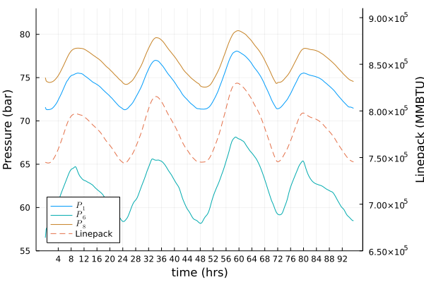
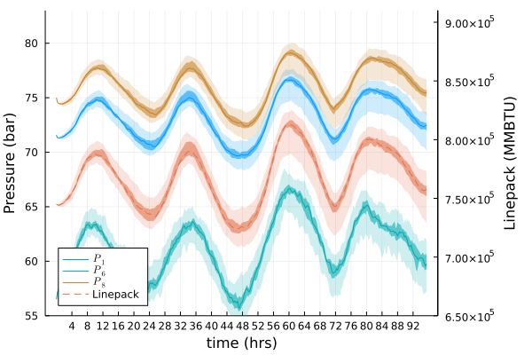
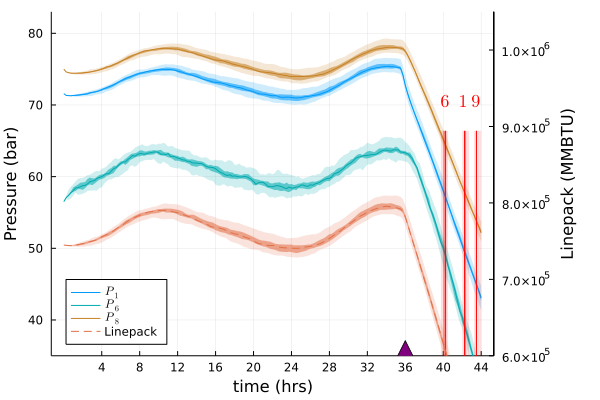
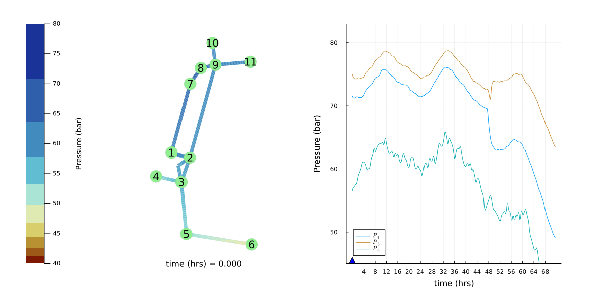

# Control of Line Pack in Natural Gas System: Balancing Limited Resources Under Uncertainty
## Abstract
We build and experiment with a realistic but reduced natural gas model of Israel. The system is unusual because (a) it is controlled from a limited number of points which are at, or close to, the gas extraction sites offshore of Israel's Mediterranean coast; (b) control specifies average flux at inlet, not pressure; (c) there are no inland compressors to regulate pressure; (d) power system is the main consumer of gas (70\% of Israel's power is generated at gas-fired power plants distributed across the country). Nature of the system suggests that a special attention should be given to understanding dynamics driven by fast transients in gas consumption meeting intra-day variations in the electricity demand, and accounting for increasing role of uncertain renewable generation (mainly solar). Based on all of the above we pose and resolve a sequence of dynamic and control challenges, such as: How to time ramping up- and down- injection of gas to guarantee a healthy intra-day line-pack which meets both pressure constraints and gas-extraction patterns? We report simulation results and utilize monotonicity properties of the natural gas flows which render robustness of our conclusions to the uncertainties of the edge withdrawals of gas.

## PSIG
The full paper is published as a part of PSIG 2023.

## Scenario 1 Illustration

## Scenario 2 Illustration

## Scenario 3 Illustration

## Scenario 5 Illustration
